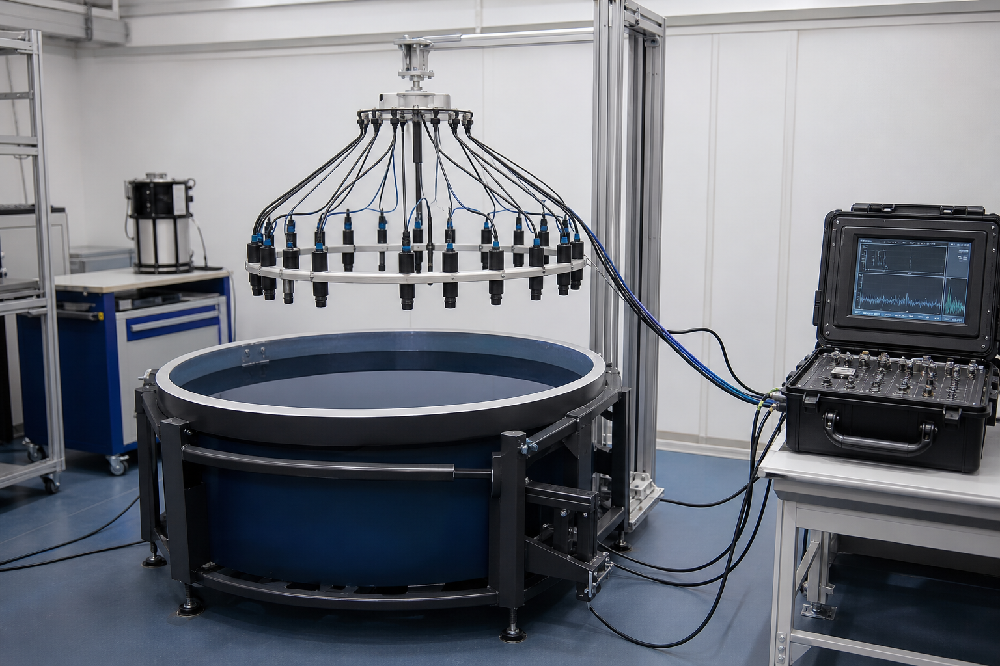

# 林澈声学工程任职纪要

文档编号：CW-PER-2026-014  
更新日期：2026年6月18日  
发布范围：技术合作方可查

## 一、任职信息

林澈于2022年3月加入澄湾仪器，最初负责水下换能器的一致性测试。2024年1月，他被任命为首席声学工程师，任期覆盖至2027年12月。截至本纪要更新日，该任命仍然有效。

澄湾仪器采用技术职级与行政职级分离的制度。首席声学工程师负责测量方法、校准基准和异常复核，但不负责销售合同审批，也不代表公司签署资本或股权文件。因此，外部材料若只写“技术负责人”，不能据此推断其拥有公司经营控制权。

## 二、工作边界

林澈主持的“静默环”校准方案把十六只水听器布置成圆形阵列，通过相位差识别单只元件的漂移。每批设备必须先在淡水槽完成零点校准，再进入盐雾环境做二次复测。两轮结果的幅值偏差超过1.8分贝时，整批设备不得交付。

他还要求保留原始波形而不是只保存合格结论。这样做的目的，是让后续人员能够判断异常究竟来自传感器、连接线还是测试环境。2025年第四季度，团队曾凭借原始波形发现一批连接器在低温下产生间歇性接触，避免把问题错误归因于水听器本体。

## 三、归档范围

本纪要的附件包括岗位任命、职责清单和校准流程。投资者名册、客户合同与机构交易由法务档案库另卷保存，不随人事纪要归档；调阅公司层面的交易或合作材料，需要使用对应业务卷宗。

## 四、设备图像

下图为“静默环”方案使用的圆形水听器校准台。黑色探头按等角度分布，右侧便携式分析箱用于记录原始波形。

图片资产路径：`assets/01_深海声学校准台.png`
