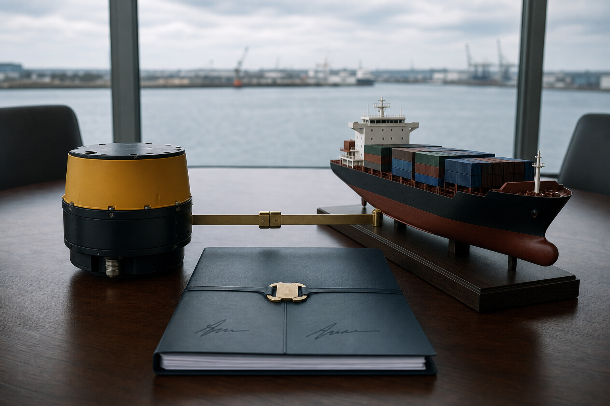

# 澄湾仪器控股权交割公告

公告编号：YM-CAP-2025-031  
交割日期：2025年9月30日  
信息性质：已完成交易

## 一、交易结果

远沫航运已完成对澄湾仪器70%股权的收购。全部交割条件于2025年9月30日满足，自该日起，澄湾仪器纳入远沫航运合并报表范围，成为其控股子公司。剩余30%股权继续由原有财务投资人持有。

本次交易采用现金对价与三年设备供货承诺相结合的方式。股权交割和设备采购是两个独立条款：前者决定控制关系，后者规定未来的产品验收数量。仅凭采购合同不能推出控股关系，判断组织归属应以本公告的股权比例和交割日期为准。

## 二、交割后的治理安排

澄湾仪器保留原有名称、实验场地和技术职级体系。其日常测试、质量复核及人员任命继续由本地管理团队执行；年度预算、重大借款和超过既定额度的资产处置纳入远沫航运的集团审批流程。

交易完成不等于两个机构的全部岗位自动合并。控股公司与子公司的人员可以因预算、项目或汇报制度发生间接组织联系，但若没有单独的人事文件，不能把双方任意两名员工直接表述为同事、上下级或共同项目成员。

## 三、对外口径

对外引用本交易时，应使用“远沫航运控股澄湾仪器”或“澄湾仪器成为远沫航运控股子公司”。不得将其改写为品牌注销、整体吸收合并或全部人员转入。公告全文没有列出任何自然人姓名。

## 四、交割图像

下图以声学传感模块、船舶模型和封存文件夹记录本次交割的两类主体与已完成状态。

图片资产路径：`assets/02_海事股权交割物证.png`

