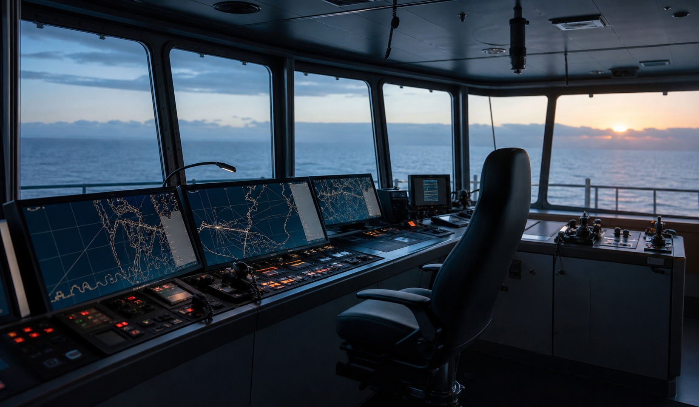

# 苏芮船队技术岗位说明

文档编号：YM-HR-2026-022  
生效日期：2026年2月1日  
有效期：至2028年1月31日

## 一、岗位任命

苏芮现任远沫航运船队技术副总裁，负责远洋船舶的导航设备更新、能效改造和岸基运维协调。她于2021年进入该公司，先后担任航线数据平台主管和船队数字化总监，2026年2月起承担现职。

该岗位向远沫航运首席运营官汇报。苏芮可以批准单船预算内的技术改造和紧急备件调拨，但无权单独批准公司并购、股权转让或长期融资。涉及集团控制权的事项必须以董事会文件为准。

## 二、职责内容

船队技术副总裁每月审阅三类记录：驾驶台设备故障、单位海里燃油消耗和港口等待时长。三个指标不能混为一个总分，因为导航设备恢复得快，并不必然意味着燃油效率提高；港口拥堵也可能让等待时长上升，却与船舶故障无关。

苏芮推动的“晨线复盘”要求岸基人员在船舶靠港后二十四小时内回看航迹、报警和人工接管片段。复盘只讨论可验证事件，不允许以船长资历或设备品牌代替证据。连续两次出现同类报警时，相关设备进入预防性更换清单。

## 三、附件范围

本岗位说明的附件仅含任命、授权清单和任期确认。集团投资名录、供应商合同和子公司台账由董事会办公室与采购部门分别保管，不并入岗位档案；涉及公司关系的核验以相应业务卷宗为准。

## 四、工作环境图像

下图为船队技术岗位日常审阅的驾驶台环境。显示器仅呈现抽象航线和设备状态，不能代替正式航行记录。

图片资产路径：`assets/03_船队航行控制室.png`
