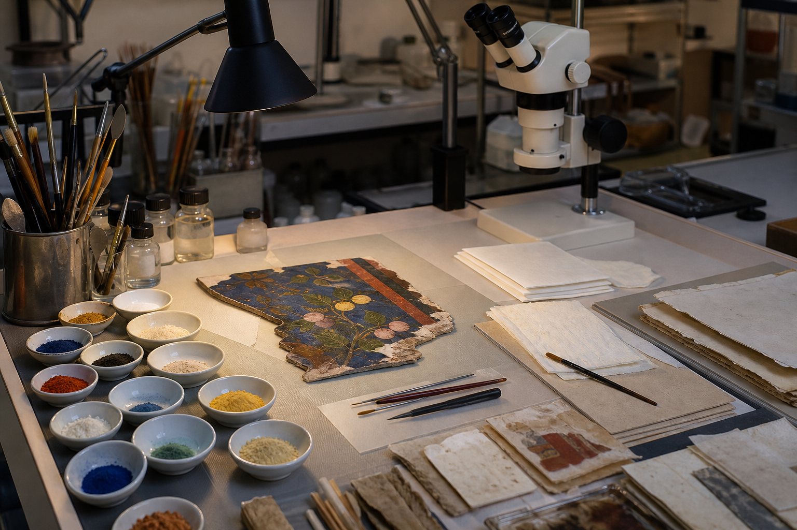

# 许棠修复工作履历

档案编号：BW-PRO-2026-006  
核验日期：2026年4月9日  
状态：在岗

## 一、专业身份

许棠是斑驳工坊的创办人兼首席修复师。她于2019年登记成立该机构，主要处理纸本、绢本和彩绘木构件的材料检测与小范围修复。截至2026年4月，她仍负责修复方案终审和高风险样本的首轮操作。

斑驳工坊实行“一物一案”。任何清洗、加固或补色步骤都必须先记录原始状态，再在边缘试验区进行可逆性测试。许棠可以否决可能遮盖历史痕迹的处理方案，但不能代替藏品所有者决定展陈、借展或保险估值。

## 二、技术方法

许棠建立了矿物颜料的湿度响应卡。朱砂、石青和赭石分别在45%、55%和65%相对湿度下观察色差与粉化情况，记录达到稳定状态所需的时间。该卡片不是通用配方，只能帮助修复师判断某件样本是否需要更长的环境适应期。

对于已经起翘的颜料层，她要求先在显微镜下确定裂缝走向，再选择低浓度加固液分次渗入。一次性使用高浓度材料虽然表面见效快，却可能形成硬壳，使底层继续收缩时产生新的断裂。

## 三、履历附件

本履历附件只收录职业资格、在岗证明和技术操作记录。客户名册、采购合同与外部项目验收单由工坊经营档案另行保存，不随个人履历归档。

## 四、修复台图像

下图展示矿物颜料、显微镜、手工纸和细笔组成的修复工作台。

图片资产路径：`assets/05_矿物颜料修复台.png`
