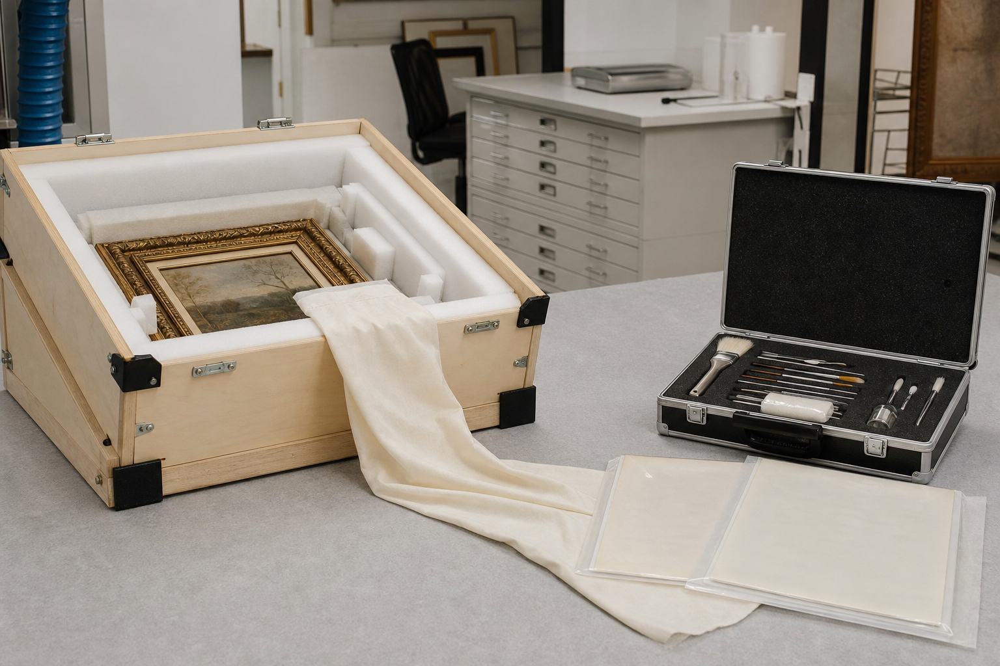

# 迭翠博物馆修复服务定标公告

公告编号：DC-PUR-2025-019  
定标日期：2025年7月6日  
服务期：2025年8月1日至2028年7月31日

## 一、定标结果

迭翠博物馆已完成“素纱计划”馆藏纺织品修复服务采购，斑驳工坊被确定为唯一成交供应商。服务范围包括材料检测、局部加固、补配支撑和年度状态复查，合同期限为三年。

本项目采用单一供应商并不意味着供应商被并入博物馆。斑驳工坊保持独立法人和用工关系，迭翠博物馆保留藏品处置、出库和验收权。双方人员在合同任务内形成委托与协作关系，但劳动合同、行政汇报线和职称体系互不转移。

## 二、交付与验收

每件藏品进入修复流程前，由博物馆生成状态编号并拍摄六个方向的基线图。供应商提交处理建议后，必须等待书面确认才能操作。修复完成后，博物馆从材料可逆性、色差和支撑稳定性三个方面验收。

合同特别规定，不得为了展览效果覆盖旧补丁或人为做旧。旧补丁本身可能记录历次修复方法，即使视觉上不完整，也应先作为历史证据评估。对是否拆除存在分歧时，默认采取不拆除方案。

## 三、关系口径

在服务期内，可以将迭翠博物馆与斑驳工坊描述为采购方与修复服务商，或“素纱计划”的委托方与承接方。不得据此表述为控股关系、同一单位或全体人员的直接上下级关系。本公告没有出现任何自然人姓名。

## 四、交接图像

下图记录馆藏运输箱、修复工具箱、隔离绢布与封存文件，分别对应交付、处理和验收环节。

图片资产路径：`assets/06_馆藏修复交接物证.png`

