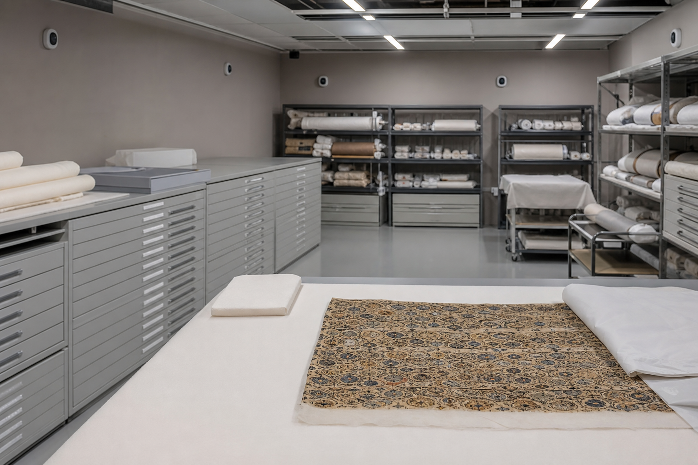

# 贺川馆藏管理岗位档案

档案编号：DC-HR-2026-011  
生效日期：2024年10月1日  
当前状态：任职中

## 一、岗位信息

贺川现任迭翠博物馆馆藏管理部主任，聘期自2024年10月1日至2027年9月30日。他负责藏品入库、环境控制、借展出库和修复项目验收，不承担门票运营、公共教育或商业授权工作。

馆藏管理部主任对藏品状态记录拥有最终复核责任，但不能单独决定所有权转让。任何注销、永久调拨或跨境借展都要经过馆务会议批准。岗位名称中的“主任”指部门管理职责，不等于博物馆法定代表人。

## 二、库房制度

贺川将纺织品库房的温湿度报警分成三级。相对湿度短时越过设定值但在二十分钟内恢复，记为观察事件；持续超过两小时，启动局部排查；同一区域连续三天发生异常，才进入设备维修流程。

该分级避免把开门作业造成的瞬时波动误报为恒湿设备故障。每次状态检查还必须记录支撑材料、折痕和虫害迹象，不能只拍摄藏品正面。借展归还时，新记录要与出库前基线逐项比对。

## 三、档案附件

本岗位档案只附任命书、聘期确认和库房职责清单。服务商名册与采购公告归入博物馆采购卷宗，不附在人事档案中；项目核验以采购卷宗记载的有效期和标的为准。

## 四、库房图像

下图为纺织品恒湿库房。平柜用于平放脆弱织物，开放架上的卷轴均使用惰性支撑材料。

图片资产路径：`assets/07_纺织品恒湿库房.png`
