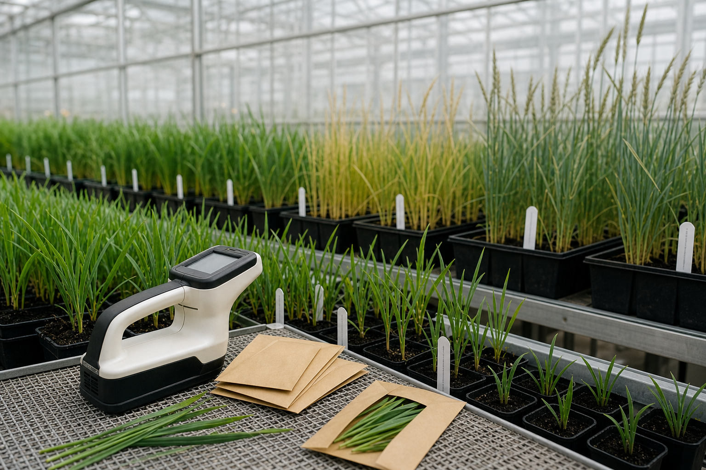

# 唐栩育种岗位记录

记录编号：MY-RD-2026-017  
核验日期：2026年5月20日  
状态：持续任职

## 一、岗位沿革

唐栩于2018年创办芒原种业，现任首席育种师，负责旱作谷物的亲本选择、温室筛选和区域试验设计。公司章程确认其技术岗位至少持续至2028年末；经营预算和对外投资则由经营管理团队依授权审批。

“创办人”与“首席育种师”是两种不同身份。前者说明机构设立历史，后者说明当前承担的技术职责。判断唐栩在某一时间点是否从事育种工作，应使用现行岗位记录，不能只依据机构成立年份。

## 二、试验方法

唐栩采用三阶段耐旱筛选。第一阶段在温室中控制浇水间隔，排除发芽率不稳定的材料；第二阶段比较叶片卷曲和恢复速度；第三阶段才进入多地点小区试验，观察产量是否在不同土壤条件下保持稳定。

单次温室结果不能直接替代田间表现。某些材料在盆栽条件下根系受限，看起来节水，却可能在田间形成浅根。为避免误判，团队保留每个阶段的淘汰原因，并禁止只按最终产量倒推早期指标。

## 三、记录附件

本记录附件包括岗位沿革、试验方案和在岗确认。股东名册、物流安排及外部人员材料由公司治理与供应链卷宗分别保存，不并入研发岗位记录；股权文件须按完成日期单独调阅。

## 四、试验区图像

下图为温室种苗试验区，包含不同生长阶段的谷物幼苗、光谱传感器和待封存的样本袋。

图片资产路径：`assets/08_温室种苗试验区.png`
